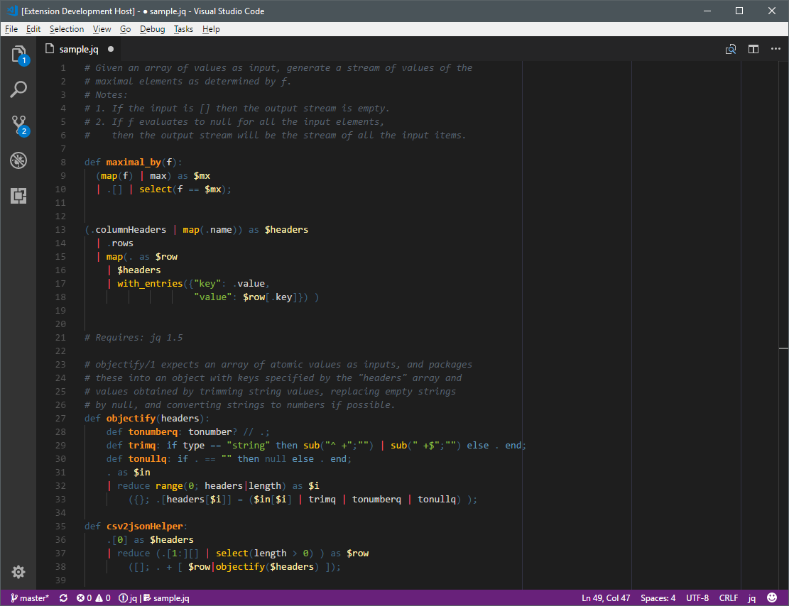

# jq-syntax-highlighting README

A syntax highlighting extension for [jq](https://stedolan.github.io/jq/), the command-line JSON processor. Use this extension to highlight `.jq` files.

## Release Notes

### 0.0.1

This is the initial release. It identifies and colors keywords, identifiers,
operators, strings, literals and comments. The pipe operator `|` is identified
as `punctuation.pipe.jq`; you can add that to your color theme to give it a
distinct color.
